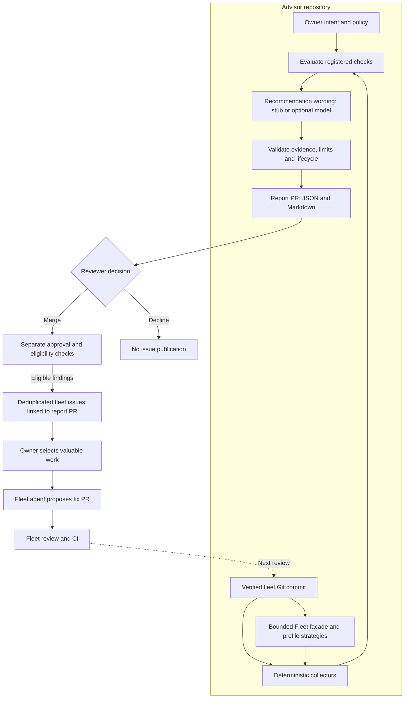

# Infra Fleet Advisor

Infra Fleet Advisor checks the declared security, reliability, cost, and
maintainability intent of the
[`infra-fleet-public`](https://github.com/ImranAdan/infra-fleet-public) GitOps
platform against a verified repository revision. It produces evidenced
recommendations for human review.

## How it works



The report PR is the decision record. Issue creation does not start a fixing
agent. Unsupported intent and incomplete collection remain visible in the
report rather than becoming automatic development tickets.

See the [end-to-end workflow](docs/WORKFLOW.md) for the commands and decisions.

## Catch divergence before it merges

The same checks run on fleet pull requests through the
[intent gate](docs/decisions/0007-pre-merge-intent-gate.md), a read-only
composite action the fleet pins by SHA. It reviews the base and the merge result, fails when
the change would newly diverge from a declared position, and explains why in
the job summary. Try it locally against any two fleet commits:

```bash
./scripts/intent-gate.sh ../infra-fleet-public BASE_SHA HEAD_SHA /tmp/intent-gate
```

## Checks that prove they bite

Every registered check has a [drill](drills/fleet-mutations.yaml): a
one-line violation of the real fleet that must make it diverge. The nightly
workflow applies each drill in a throwaway worktree, so a check that silently
stops seeing the fleet goes red instead of inflating coverage.

## Run a local review

Requires Git, Python 3.11+, `uv`, and Make. Clone both repositories alongside
one another:

```bash
git clone https://github.com/ImranAdan/infra-fleet-public.git
git clone https://github.com/ImranAdan/infra-fleet-advisor-public.git
cd infra-fleet-advisor-public
make setup
make review
```

Open `review-output/report.md`. The default deterministic `stub` makes no model
API call. The fleet checkout must be clean; the review leaves it unchanged.
Local output does not replace the approved report baseline.

See [local setup](docs/setup.md) for custom paths and troubleshooting.

## Guides

| I want to… | Read |
|---|---|
| Run the full report-to-fleet process | [End-to-end workflow](docs/WORKFLOW.md) |
| Configure or run a local review | [Local setup](docs/setup.md) |
| Write or change intent | [Intent guide](docs/intent.md) |
| Configure report PR delivery and review reports | [Report guide](docs/reports.md) |
| Configure fleet issue creation or retry publication | [Fleet publication guide](docs/fleet-publication.md) |
| Understand current support and limitations | [Scope and coverage](docs/status.md) |
| Develop and propose changes | [Contributing](CONTRIBUTING.md) |
| Understand security boundaries or report a vulnerability | [Security](SECURITY.md) |

Optional feedback, mechanical remediation, architecture and decision records
are listed in the [documentation index](docs/README.md).

## Current scope

The advisor reviews one public fleet repository. Twenty declared positions span
security, reliability, cost, and maintainability. Twenty registered checks, one per declared position, cover
workflow credentials (including local composite actions), scan-gated ECR
publication, Dependabot coverage, literal Terraform IAM policies, Kubernetes
rollouts, container hardening, ingress restriction, bounded egress, HTTPS on
public ingress, service-account token privilege, staging-only public EKS
endpoints, the session-cookie CSRF control, scheduled release of idle staging
capacity, staging log retention, ECR
image lifecycle, cost-allocation tags, demand-driven worker scaling, the Fleet
profile lifecycle, local first use, and AWS onboarding and teardown. Accepted
risks are checked as guardrails: the check proves the conditions that made the
risk acceptable still hold.
Positions without a trusted check remain explicitly unverified. Repository
analysis does not establish live infrastructure health.

## License

[MIT](LICENSE)
