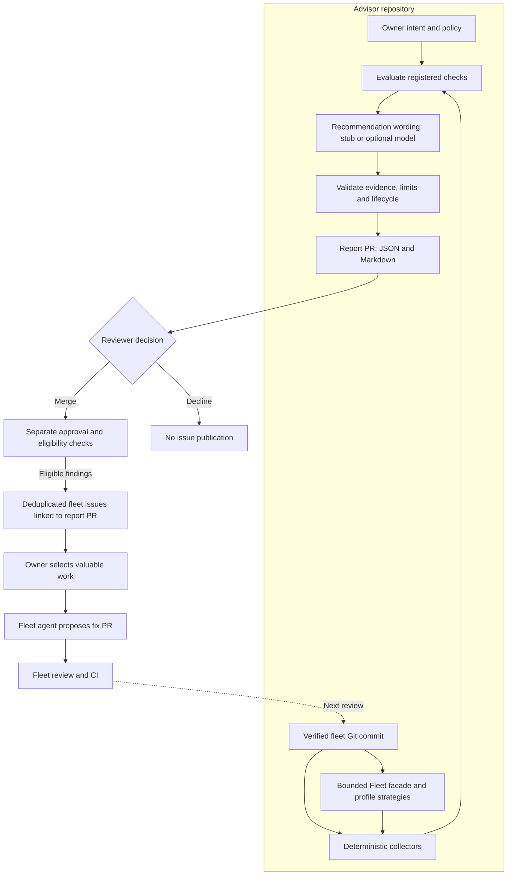

# Infra Fleet Advisor

Infra Fleet Advisor checks the declared security, reliability, cost, and
maintainability intent of the
[`infra-fleet-public`](https://github.com/ImranAdan/infra-fleet-public) GitOps
platform against a verified repository revision. It produces evidenced
recommendations for human review.

## How it works



The report PR is the decision record. Issue creation does not start a fixing
agent. Unsupported intent and incomplete collection remain visible in the
report rather than becoming automatic development tickets.

See the [end-to-end workflow](docs/WORKFLOW.md) for the commands and decisions.

## Run a local review

Requires Git, Python 3.11+, `uv`, and Make. Clone both repositories alongside
one another:

```bash
git clone https://github.com/ImranAdan/infra-fleet-public.git
git clone https://github.com/ImranAdan/infra-fleet-advisor-public.git
cd infra-fleet-advisor-public
make setup
make review
```

Open `review-output/report.md`. The default deterministic `stub` makes no model
API call. The fleet checkout must be clean; the review leaves it unchanged.
Local output does not replace the approved report baseline.

See [local setup](docs/setup.md) for custom paths and troubleshooting.

## Guides

| I want to… | Read |
|---|---|
| Run the full report-to-fleet process | [End-to-end workflow](docs/WORKFLOW.md) |
| Configure or run a local review | [Local setup](docs/setup.md) |
| Write or change intent | [Intent guide](docs/intent.md) |
| Configure report PR delivery and review reports | [Report guide](docs/reports.md) |
| Configure fleet issue creation or retry publication | [Fleet publication guide](docs/fleet-publication.md) |
| Understand current support and limitations | [Scope and coverage](docs/status.md) |
| Develop and propose changes | [Contributing](CONTRIBUTING.md) |
| Understand security boundaries or report a vulnerability | [Security](SECURITY.md) |

Optional feedback, mechanical remediation, architecture and decision records
are listed in the [documentation index](docs/README.md).

## Current scope

The advisor reviews one public fleet repository. Twenty declared positions span
security, reliability, cost, and maintainability. Eleven registered checks cover
workflow credentials, scan-gated ECR publication, literal Terraform IAM policies,
Kubernetes Deployment rollouts and container hardening, staging log retention,
ECR image lifecycle, cost-allocation tags, the Fleet profile lifecycle, local
first use, and AWS onboarding and teardown.
Positions without a trusted check remain explicitly unverified. Repository
analysis does not establish live infrastructure health.

## License

[MIT](LICENSE)
