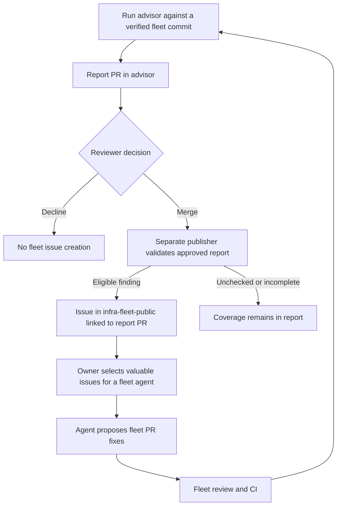

# Report approval to fleet work

[Documentation index](README.md)

The report PR is the issue-creation decision record. The owner chooses which
resulting fleet issues are valuable enough for an agent to implement.



## Run a review

```bash
gh workflow run fleet-advisory.yml \
  --repo ImranAdan/infra-fleet-advisor-public \
  -f target_ref=main -f synthesizer=stub
```

The scheduled workflow also reviews daily. It compares with the approved report
in advisor main and proposes changed material on `advisory/latest`. An unchanged
result or the same declined report creates no new PR. The deterministic stub
runs the implemented checks; it does not invent missing checks.

## Review and merge the report PR

Inspect evidence, impact, suggested changes, trade-offs and coverage. Obtain
required Quality checks; a default-token bot run may need maintainer approval
or a reviewed maintainer push. Optional advisor-only App delivery is described
in the [report guide](reports.md). Merge the report-only PR to approve eligible issue creation,
or close it to decline that material report. Implementation PRs are separate.

The configured fleet publisher verifies the merged PR and exact approved report,
then creates eligible issues in `infra-fleet-public`. Every new issue links back
to the report PR and approved report commit. Incomplete relevant collection,
suppression and accepted trade-offs do not produce fresh fix requests.

## Select fleet issues for an agent

In the fleet project, ask the agent to inspect advisor-labelled issues and
propose PR fixes for the ones you choose. The agent should check current source,
the approving report and applicability before editing. Issue creation does not
automatically start an agent. Review and merge its fleet PRs through fleet CI.

Run another review after fixes. Existing findings reuse their issue identity;
no-longer-detected findings receive a resolution note, while issue closure and
accepted trade-off decisions remain with the maintainer. Unsupported positions
stay in the report instead of generating advisor tickets.

## Retry a publication

If the approved report merged but publication failed, retry the same report PR:

```bash
gh workflow run fleet-issues.yml \
  --repo ImranAdan/infra-fleet-advisor-public -f report_pr=<merged-report-pr>
```

The publisher deduplicates each issue action. The approved report must still be
the current merged baseline under current policy and intent. A superseded or
declined report cannot be used for a retry. See
[fleet publication](fleet-publication.md) for the issues-only App configuration
and [feedback](feedback.md) for the separate optional integration.
