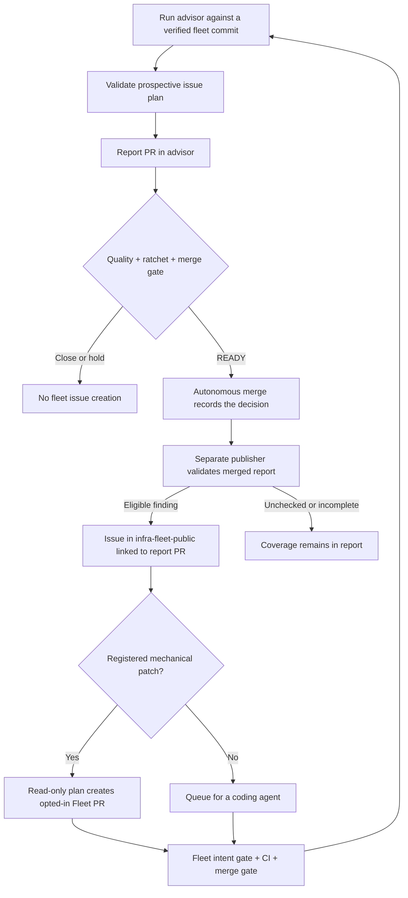

# Autonomous report-to-fleet work

[Documentation index](README.md)

The report PR remains the issue-creation decision record. Routine reversible
work advances through exact-head evidence; the owner is involved only for an
explicit hold or an owner-only merge category.


```mermaid
flowchart TD
    A[Run advisor against a verified fleet commit] --> P[Validate prospective issue plan]
    P --> B[Report PR in advisor]
    B --> C{Quality + ratchet + merge gate}
    C -->|Close or hold| D[No fleet issue creation]
    C -->|READY| E[Autonomous merge records the decision]
    E --> V[Separate publisher validates merged report]
    V -->|Eligible finding| F[Issue in infra-fleet-public linked to report PR]
    V -->|Unchecked or incomplete| G[Coverage remains in report]
    F --> H{Registered mechanical patch?}
    H -->|Yes| I[Read-only plan creates opted-in Fleet PR]
    H -->|No| K[Queue for a coding agent]
    I --> J[Fleet intent gate + CI + merge gate]
    K --> J
    J --> A
```

## Run a review

```bash
gh workflow run fleet-advisory.yml \
  --repo ImranAdan/infra-fleet-advisor-public \
  -f target_ref=main -f synthesizer=stub
```

The scheduled workflow also reviews daily. It compares with the approved report
in advisor main and proposes changed material on `advisory/latest`. An unchanged
result or the same declined report creates no new PR. The deterministic stub
runs the implemented checks; it does not invent missing checks. Before proposing
a report, the workflow builds the complete prospective fleet issue plan with a
placeholder approval record. Invalid recommendations, fingerprints, evidence,
limits, or issue bodies therefore fail before a report can enter the autonomous
lane.

## Automatic report decision

Every generated report contains `<!-- autonomous-merge -->`. After Quality and
the ratchet pass, the trusted default-branch worker runs the merge gate against
the exact head. `READY` merges and authorizes eligible issue creation. Remove
the marker to hold the report, or close it to decline that material signature.
Quality and the report workflow wake the worker directly; a six-hour run
recovers missed events or transient ordering between checks.

The report workflow uses `GITHUB_TOKEN` and explicitly dispatches read-only
Quality on the report branch because token-created PRs do not emit ordinary
pull-request events. No report delivery secret is required.

The configured fleet publisher independently revalidates the merged PR and exact
approved report, then creates eligible issues in `infra-fleet-public`. Every new
issue links back to the report PR and approved report commit. Incomplete relevant
collection, suppression and accepted trade-offs do not produce fresh fix
requests.

The merge worker dispatches publication explicitly because a token-authored
merge does not start another workflow. A daily recovery run replays the newest
merged report through the same idempotent publisher.

Merging also updates `reports/report.json` on `main`, which the fleet's Grafana
reads: the **Declared intent** row of its Fleet Application dashboard shows the
approved counts, the reviewed fleet commit and the divergent positions beside
the live golden signals. A declined or unmerged report never appears there.

## Turn Fleet issues into fixes

The Fleet's `Advisor remediation` workflow polls the merged report. For a
registered deterministic patcher it plans without write permission, transfers a
patch artifact to a Fleet-owned write job, and opens an opted-in Fleet PR. The
Fleet-owned job explicitly dispatches bounded validation on that exact branch;
the intent gate, CI and merge gate decide it. No Advisor process receives a
Fleet contents token.

Other issues require a coding-agent runtime to inspect the current source and
propose a PR. Include the autonomous marker; reversible evidence-approved work
then merges without an owner click. IAM, credentials, permissions, migrations,
permanent infrastructure, intent and merge authority remain owner decisions.

Run another review after fixes. Existing findings reuse their issue identity;
no-longer-detected findings receive a resolution note, while issue closure and
accepted trade-off decisions remain with the maintainer. Unsupported positions
stay in the report instead of generating advisor tickets.

## Retry a publication

If the approved report merged but publication failed, retry the same report PR:

```bash
gh workflow run fleet-issues.yml \
  --repo ImranAdan/infra-fleet-advisor-public -f report_pr=<merged-report-pr>
```

The publisher deduplicates each issue action. The approved report must still be
the current merged baseline under current policy and intent. A superseded or
declined report cannot be used for a retry. See
[fleet publication](fleet-publication.md) for the issues-only App configuration
and [feedback](feedback.md) for the separate optional integration.
