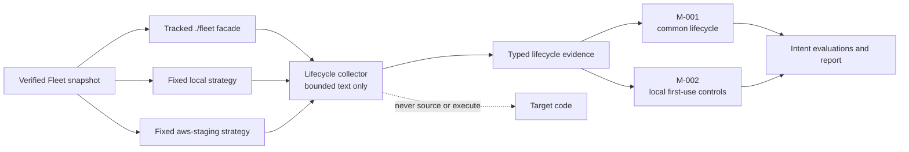

# Architecture

## Architectural intent

The MVP is a bounded intent-to-work pipeline for one known GitOps repository.
It continuously evaluates declared positions, but it is not a general agent
platform: configuration cannot invent executable checks and every mutation
remains behind human review.

```text
Intent catalog → static check registry ───────────────┐
                                                      │
Verified fleet snapshot → collectors → evidence set ─┼→ evaluations
                                                      │       │
Advisor policy ───────────────────────────────────────┘       ├→ satisfied
                                                              ├→ unverified
                                                              │    coverage in report; no issue
                                                              └→ divergent
                                                                     │
                                      required candidate ← analyst wording
                                                                     │
Prior report ─────────────────────────────────────────────→ validation/lifecycle
                                                                     │
                                                        JSON + Markdown report
                                                                     │ merged
                                                                     ↓
                                            revalidated issue plan → fleet issue
                                                                        │
                                                       human decision / fleet PR
                                                                        │
                                                                  fleet CI + merge
```

## Domain boundaries

### `config`

Owns the closed advisor-policy and intent-catalog contracts, safe loading,
defaults, canonical intent digest, and validation. Policy expresses priorities,
trade-offs, and constraints. Intent declares propositions and static check
identifiers. Neither selects arbitrary code or contains workflow logic.

### `provenance`

Verifies and records the fleet source revision and the identities of policy,
collectors, advisor, and model used for a run. Private machine paths are kept
separate from public report provenance.

### `core`

Owns immutable evidence and recommendation models, validation, fingerprints,
lifecycle comparison, ranking inputs, report outcomes, and bounded pipeline
coordination. It remains independent of GitHub, model SDKs, and filesystem
layout.

### `scenarios`

Contains the single `fleet_repository_review` vertical slice. The scenario
selects known collectors, binds intent checks through a static registry,
evaluates propositions, prepares approved evidence for synthesis, and defines
the advisory taxonomy. A second scenario must represent a real product need,
not a speculative extension point.

### `runtime`

Binds a verified checkout, policy, prior report, model client, output streams,
explicit scenario provider, and external publication plans for one invocation.
It owns CLI composition, safe output handling, and GitHub adapter inputs but not
recommendation semantics.

Local review defaults to the deterministic stub; a real model is explicitly
selected. `report-readiness` checks merged-report source identity and compares
policy version and intent digest before fleet issue publication.
Missing or stale reports cause those workflows to wait without making a new
baseline. Malformed provenance fails. Readiness is only an ordering gate: the
existing publication plan validators still own evidence and eligibility checks.
Fleet publication requires `FLEET_ISSUES_ENABLED=true`; optional feedback is
independently enabled through `FLEET_FEEDBACK_ENABLED=true`.
Remediation reuses issue-plan validation before selecting active, eligible
fingerprints and needs a write token only when proposing a fleet PR.
An optional advisor-only GitHub App delivers report PRs so their events trigger
normal quality checks. Its identity is derived from the token-minting action,
never report or PR prose. Bounded decline history recognizes that configured
bot and the original GitHub Actions bot. The fallback requires no App but cannot
trigger ordinary PR quality checks.

## Supporting adapters

Repository parsers, subprocess-backed scanners, Git verification, model
clients, and report serializers sit at explicit boundaries. Their outputs are
converted into typed domain values before entering the core.

The first implementation should add only the adapters needed by one useful
end-to-end review. Do not introduce dynamic plugin discovery, an arbitrary
command runner, a database, async workers, or multi-repository orchestration.

## Trust boundaries

### Target repository

Repository contents are untrusted input, even though the initial target is
public and owned by the same maintainer. Text found in source files cannot alter
advisor policy, tool permissions, system prompts, or publication rules.

### Deterministic collectors

Collectors are explicitly registered in code. They have read-only access to the
verified snapshot and return closed evidence types. Configuration cannot supply
commands or import paths.

Collectors also declare the identity components used to derive each evidence
ID. Terraform IAM evidence uses its root-module directory and stable resource
address without the `.tf` filename, so moving a resource between files in the
same module preserves lifecycle identity without conflating separate root
modules. GitHub Actions evidence remains keyed by workflow path and step locator
because steps without explicit IDs have no stable resource handle; file moves
or inserted steps can therefore still produce a one-time lifecycle change.
Kubernetes Deployment rollout evidence uses the API version, kind, namespace,
and name as its stable handle. Duplicate declarations of that handle make
coverage partial and are withheld rather than selecting one declaration
arbitrarily.

Fleet lifecycle evidence uses one stable identity for the common profile
dispatch contract. Its collector reads only the tracked `fleet` facade and
fixed `local` and `aws-staging` strategy modules as bounded text. It recognizes
a closed shell structure for both routes and never sources or executes
repository code. The same evidence record supports separate M-001 lifecycle and
M-002 local first-use evaluations, so one collector traversal cannot silently
expand into a new execution boundary. Unknown structure, exclusions, untracked
files, links, and unreadable input make coverage partial instead of becoming a
finding.



M-002 recognizes the fixed local installer invocation, Git-common-directory
state, explicit kubectl and Flux context, and printed startup command. These
facts can prove a declared control is absent. Their presence cannot prove that a
download succeeded, Docker was available, or a real cluster became ready, so a
structurally complete implementation remains `declared_unverified`.

The Deployment collector reads only bounded, tracked YAML under `k8s/`. It
resolves RollingUpdate percentage fenceposts against desired replicas, records
readiness-probe coverage, and emits one typed capacity fact per unambiguous
`apps/v1` Deployment. Malformed, excluded, untracked, duplicate, or truncated
inputs cannot prove satisfaction. The R-001 trusted rule projects only evidence
under `k8s/applications/`; collecting platform Deployments does not make them
owner-managed application policy.

The same traversal emits a second, separately identified hardening fact per
Deployment: every container and init container must resolve to a non-root user
(`runAsNonRoot` or a positive `runAsUser`, container over pod), set
`allowPrivilegeEscalation: false`, not be privileged, drop `ALL` capabilities and
add none. A malformed security context withholds only the hardening fact. S-002
projects the fact only under `k8s/applications/`.

The Terraform cost collector reads tracked `.tf` files under `infrastructure/`
and emits two closed facts. Log-retention evidence covers each
`aws_cloudwatch_log_group` (absent retention means never expires) and each
`terraform-aws-modules/eks/aws` module call, whose control-plane log group is
derived from the published defaults of a trusted major version, without
downloading the module. ECR evidence joins each repository to its lifecycle
policy within one root module and records whether untagged images expire and
every retained image is bounded by count or age. Variables, multi-line
expressions, unknown module majors and unresolved policy references make
coverage partial rather than assuming a value. C-003 projects log retention only
under `infrastructure/staging/` and cannot prove satisfaction, because AWS
services create log groups the repository never declares.

The same collector records, per `provider "aws"` block, which of the
environment, service and owner keys its `default_tags` apply, resolving one
level of `local.name` from the same root module. Computed tags such as `merge()`
make coverage partial. C-005 is divergence-only because provider defaults do
not reach every billed resource.

For S-011 the workflow collector emits one record per job that logs in to ECR
(`amazon-ecr-login`, `docker/login-action` with an ECR registry, or
`aws ecr get-login-password`). The job is gated when an unconditional Trivy step
with `CRITICAL,HIGH` and a non-zero `exit-code` runs earlier in the job, or in a
job reached through `needs` where no job on the path uses `always()`,
`failure()` or `cancelled()` in its condition.

Workflow and Terraform source-file budgets apply after policy exclusions and
tracked-path filtering. Downloaded `.terraform` files are local tool state and
are ignored unless explicitly tracked, so initialized checkouts retain the same
available source budget. IAM collection follows the registered
`infrastructure/permanent` scope. The parser accepts bounded JSON/HCL literals,
quoted condition keys, local traversals in fields that do not decide the finding,
and interpolated Resource strings only when fixed text proves they cannot equal
the exact wildcard `*`. It distinguishes comments from string values and heredoc
examples. Duplicate keys, malformed statements, dynamic Action/Effect values,
unknown Resource values, and referenced policy documents make coverage
partial. It never executes Terraform, resolves local references, or fetches a
policy URL. The wildcard check detects explicit Allow/Action/Resource grants;
it does not establish the effective permissions after conditions and denies.

Historical-only recommendation citations retain their original evidence facts.
Freshly validated recommendations use the current collection even when a
stable evidence ID is also present in the prior report. This keeps resolution
notes verifiable after a resource's desired state changes.

### Intent compilation

Markdown intent bodies are untrusted declarative data. A check identifier resolves
only through an explicit in-code registry containing its collector, evidence
kind, deterministic support predicate, repository scope, concern, and template.
Unknown identifiers never trigger code generation or dynamic discovery; their
propositions are recorded as `declared_unverified`.

Compilation yields immutable evaluations and one required candidate per
divergent proposition. Partial collector coverage cannot prove satisfaction.
Required work contains the complete conflicting evidence set and must fit the
policy's hard recommendation bound or the run fails explicitly.

### Model

The model receives a bounded projection of active intent, policy, and evidence.
It cannot read files, run tools, publish reports, or request broader access. Its
structured response is untrusted until validated. Valid analyst wording replaces
a deterministic template only when category, concern, priority, and complete
evidence set produce the exact compiled fingerprint; otherwise the template is
used and the analyst output is rejected.

### Publication

Deterministic code checks schema, evidence existence, category, intent identity,
limits, and secret-safe fields. Every compiled divergence reaches JSON and
Markdown through either valid analyst wording or its trusted fallback template.

Report delivery derives a versioned signature from deterministic material only:
the policy version, intent digest and evaluations, recommendation fingerprints
and lifecycle, cited evidence records including repository locations, collector
coverage records, rejection reasons, and accepted trade-offs. Model prose,
ranking, and run timestamps are excluded. The signature is recorded as an inert
marker in an advisory pull request. Deterministic code reads a bounded, complete
branch history and selects
the latest workflow-authored decision. An unmerged decision with the same exact
marker is a decline; a newer workflow merge supersedes it. Arbitrary
pull-request prose never enters analysis or policy.

Fleet issue publication is a second publication boundary after report merge.
Deterministic code reloads the report under the current policy and intent
catalog, verifies the catalog digest, recomputes every fingerprint, resolves
every citation, validates evidence support and secret-safe fields, and emits a
bounded issue plan carrying the originating intent identity. A workflow adapter
consumes only that plan. It uses an installation token limited to
`issues: write`, deduplicates on a per-fingerprint label and body marker, and never
changes issue state. Resolution means “no longer detected” and produces an
idempotent note for human review, not automatic closure.

The merged report-only PR is the fleet issue-creation decision record. A
bounded GitHub API record proves the PR merged into advisor main and changed
only the report JSON and Markdown. Trusted default-branch code materializes
that merge's report and verifies it remains the current merged baseline before
validating against current policy and intent. Every issue links to the PR and
approved report commit. Retries use the same PR and deduplicate per fingerprint.
Incomplete relevant collection defers issue and resolution actions rather than
promoting historical carry-forwards into fresh fix requests.

Unverified propositions remain in report coverage. There is no automatic
advisor issue publisher or agent dispatcher. The maintainer selects valuable
fleet issues and instructs a fleet agent to propose reviewed fixes. The earlier
generated advisor tickets are retained as a linked coverage snapshot.

Fleet decision feedback is a third deterministic boundary. The GitHub adapter
projects fleet issues into number, state, author, and label sets; title, body,
and comments are discarded at the boundary. Trusted code accepts only closed,
App-authored advisor issues with one fingerprint and one reason from a static
vocabulary. It resolves the fingerprint against the revalidated current report
and refuses to widen one issue into a concern-level policy decision when that
concern has multiple active findings. The resulting plan changes only
`policy.yaml`, assigns a deterministic new policy version, and is proposed as a
human-reviewed pull request in the advisor repository. A fleet token with
`issues: read` cannot change the fleet. A stale report caused by a policy or
intent change pauses feedback without withdrawing an open proposal. An open
workflow-authored proposal is withdrawn only after current evidence shows its
source labels or closed state were revoked; a typed cancellation marker prevents
that closure from becoming a decline record. Declines are matched by signature
across a bounded complete history rather than only the newest proposal. A
workflow-owned branch left by partial PR creation is recoverable only when its
single parent is merged history and its sole changed path is `policy.yaml`;
replacement remains protected by an exact lease.

## Run lifecycle

1. Load and validate the intent catalog and advisor policy.
2. Verify or materialize a clean target snapshot at its declared full Git SHA.
3. Execute the explicitly configured collector set within hard bounds.
4. Record collector coverage and failures.
5. Assign stable evidence IDs and compile every proposition through the static
   check registry.
6. Record satisfied, divergent, and declared-unverified evaluations.
7. Create a required candidate for each divergence and project bounded intent,
   policy, and evidence into synthesis.
8. Parse the model response and retain only exact compiled work identities,
   filling omissions from trusted templates.
9. Resolve every cited evidence ID against the captured evidence set.
10. Compute stable fingerprints and compare with the prior report.
11. Apply deterministic output limits and ordering rules.
12. Write equivalent JSON and Markdown reports.
13. Verify the merged report PR decision record, materialize its approved report
    and publish eligible fleet issues. Keep unverified positions in coverage.
14. A maintainer selects fleet issues for an agent; proposed fixes go through
    fleet review and CI, then a subsequent advisor report evaluates the result.

## Initial implementation shape

When code is introduced, use a small Python 3.11+ package managed by `uv`:

```text
src/infra_fleet_advisor/
├── config/
├── core/
├── provenance/
├── runtime/
└── scenarios/
    └── fleet_repository_review/
```

Mirror behavior under `tests/`. Delay exact modules until the first vertical
slice establishes concrete responsibilities.
